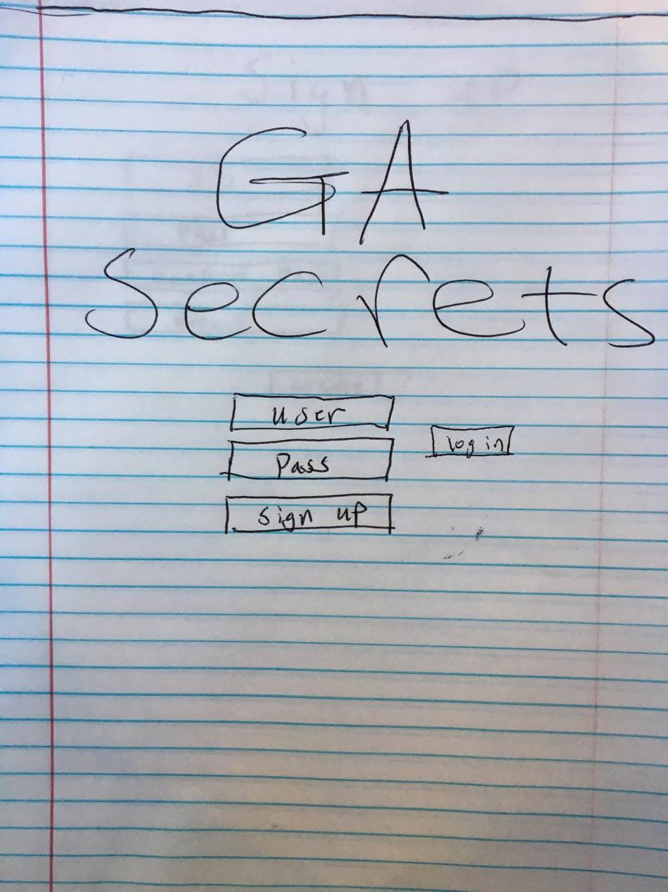
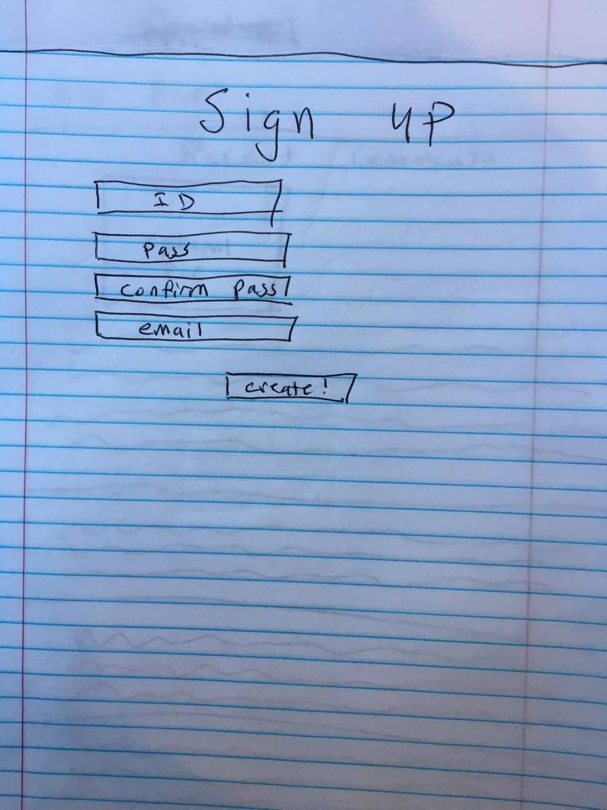
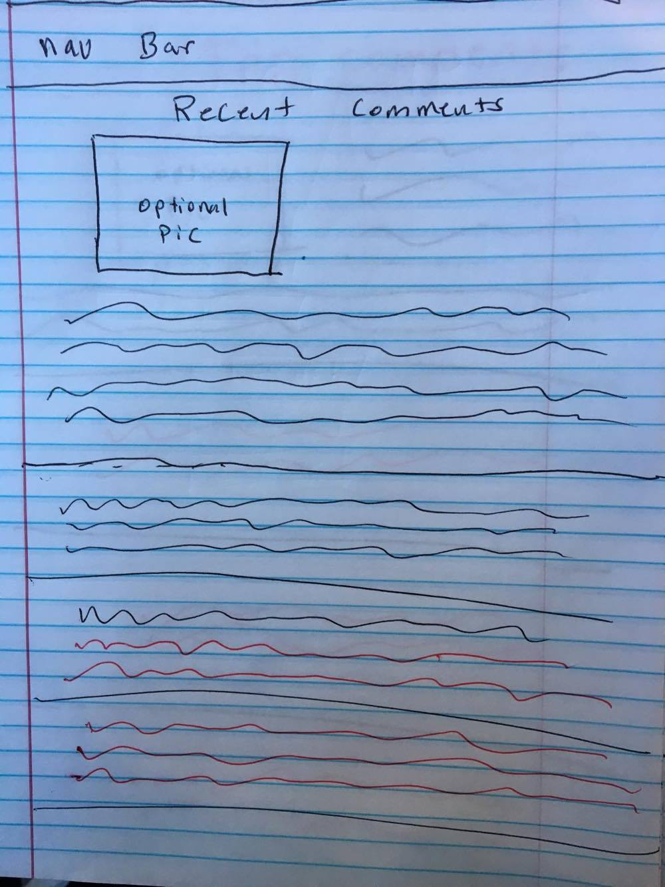
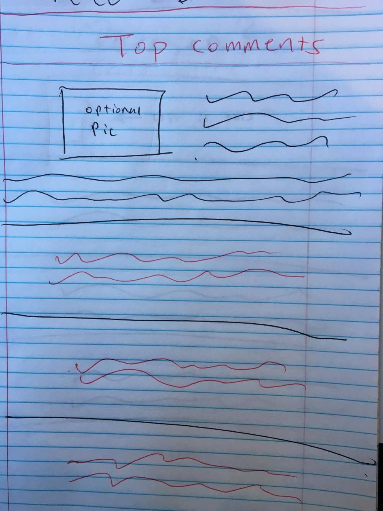
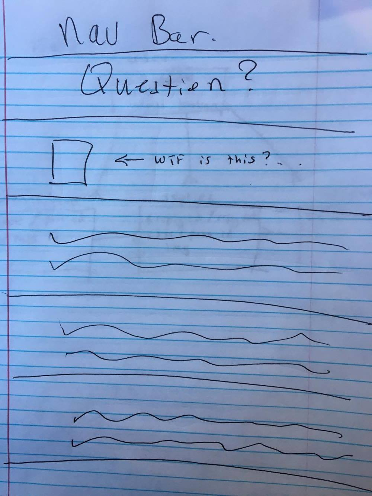
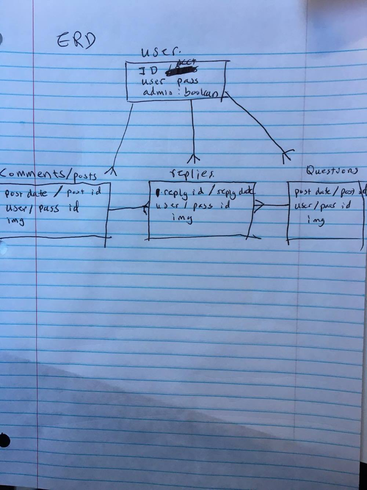

# GA Secrets

Read Me:

* Trello: https://trello.com/b/NEK0uTFh/ga-secrets

* Approach Taken: GA Secrets will be an anonymous website where users can make any posts, comments or questions for the GA community.

* Github:https://github.com/da1271/GA-Secrets1

* Tech used: Ruby 2.3.1, rails 5.0.1, js, css, html, postgresql, heroku, gems

* Unsolved issues: completed all MVP's.

* Installation process: link

* Wireframes: 

